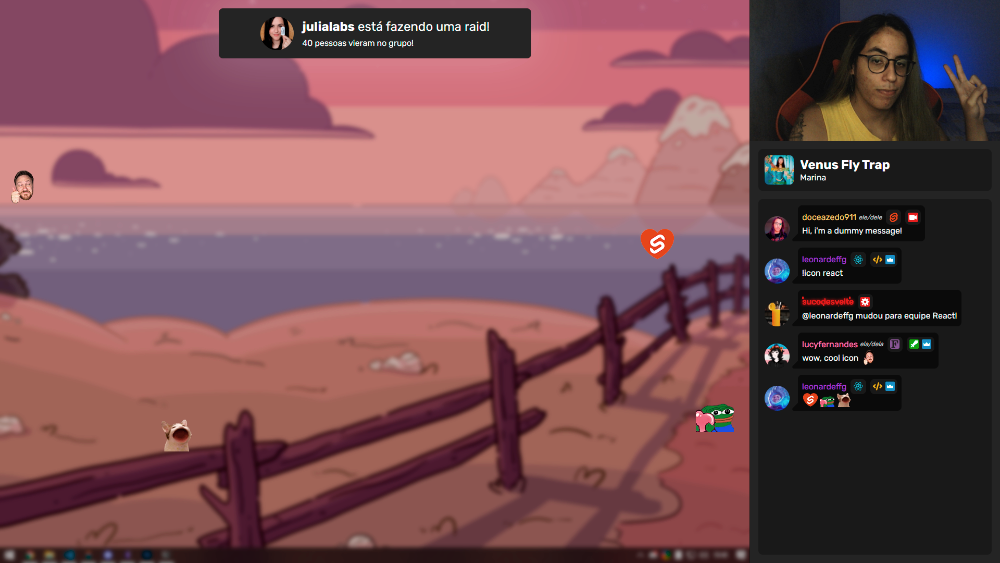

<h1 align="center">DoceAzedo's Overlay</h1>

<p align="center">
  A set of highly interactive scenes for my <a href="https://twitch.tv/doceazedo911">live coding streams</a>, including a Spotify now playing widget, Reddit memes while I'm away, custom icons and chat commands integration with <a href="https://github.com/doceazedo/suco-bot">SucoBOT</a>.
</p>

<p align="center">
  
  <sup>Cute wallpaper made by the outstanding <a href="https://twitter.com/saroliro/status/1417469066604859393">@saroliro</a> ✨</sup>
</p>

## 📝 Notes

- This is in **constant development** and I'm always open for new features ideas and pull requests! 🥳
- This is **not intended for others to use** by themselves, but if you really want to, keep in mind it has fixed sizings and your desktop resolution should be `1440x1080` and your stream output `1920x1080`. 🖥️

## 🧰 Installation

1. Clone this repository.
2. Run `yarn` or `npm install` to install the dependencies.
3. Create a [Spotify app](https://developer.spotify.com/dashboard/login) and grab your [refresh token](https://benwiz.com/blog/create-spotify-refresh-token) with the `user-read-currently-playing` scope.
4. Create a [Twitch app](https://dev.twitch.tv/docs/authentication/register-app) and grab an [OAuth token](https://twitchapps.com/tokengen) - this can be from your personal account or any other, as no messages will be sent from it - with the following scopes: `chat:read chat:edit channel:moderate whispers:read whispers:edit channel_editor channel:read:subscriptions`.
5. Optionally yet highly recommended, setup the [SucoBOT](https://github.com/doceazedo/suco-bot).

## 🤹‍♂️ Usage

You can start the production server with:

```bash
yarn start
```

If you want to contribute or develop custom features, you can start the development server with:

```bash
yarn dev
```
